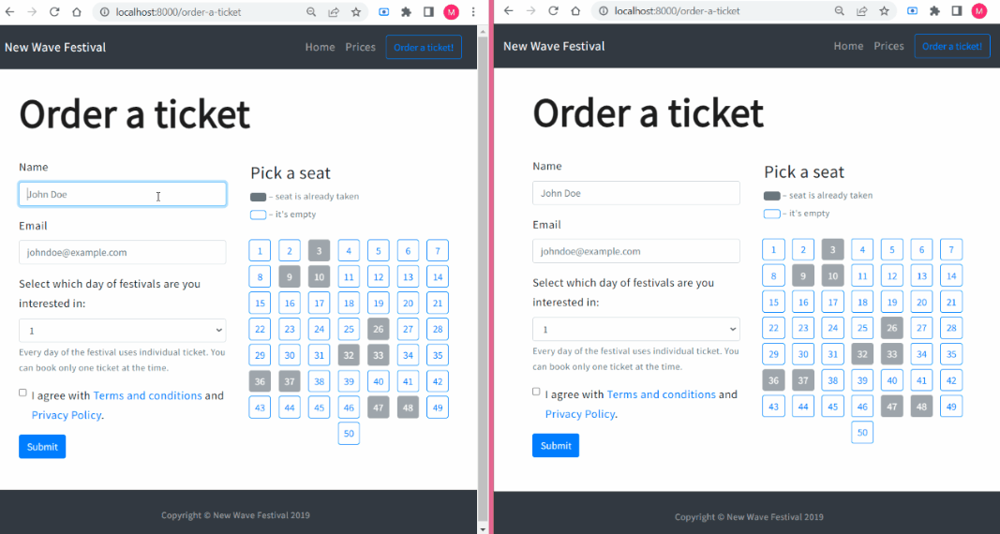

<p align="center">
</a>
</p>
<br>


# REST-APi in practice - full-stack website


A music festival full-stack website that allows you to browse concerts and their prices. 
In the ticket booking sub-page you can book a ticket and block availability in real time. The subpage uses information from the server about the number of available places. Thanks to this the user can book only available places.

[:sparkles: Published version](https://damp-stream-40700.herokuapp.com/)


## Tech Stack

* CSS
* HTML
* Bootstrap
* JavaScript
* React
* React Router
* Redux
* [Express](https://expressjs.com/)
* [Socket.io](https://socket.io/)

  
## Lessons

* think of front-end as client-side and back-end as server-side
* implementation of the API server
* use Express.js middleware
* test HTTP requests using [Postman](https://www.postman.com/)
* server configuration - to allow connections from "foreign" servers (connect front-end with back-end)
* validate received data on server side
* use [CORS](https://www.npmjs.com/package/cors) to restrict connections to the API 
* use [Nodemon](https://www.npmjs.com/package/nodemon) to to live server
* prepare the server for publishing the website on Heroku

  
## Run 

Install dependencies

```bash
  npm install // yarn install
```

Start the server with nodemon

```bash
  npm start // yarn start
```

## Authors

:woman: [@marcelaos](https://github.com/marcela-os)